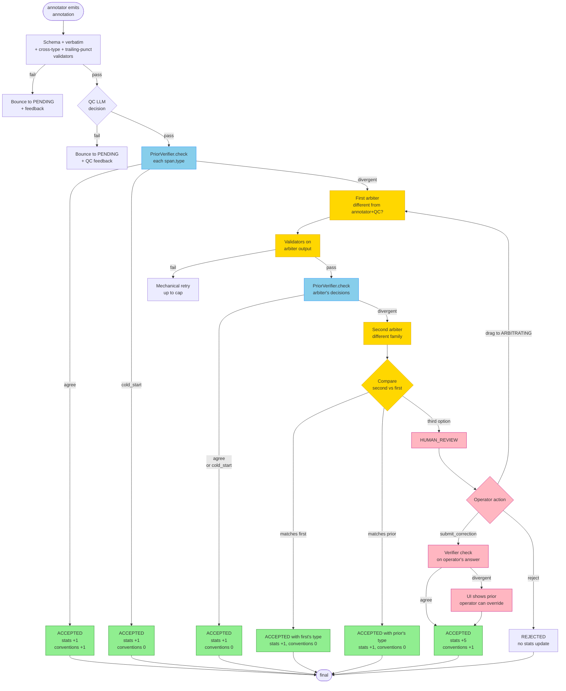

# Prior-driven Verifier + Post-hoc Audit

**Status**: spec
**Author**: brainstorm 2026-05-17

## 1. Problem

Multi-agent LLM annotation pipelines suffer from **correlated errors** and
**information cascade**:

- Annotator + QC consensus is not independent voting — both LLMs share
  training-data biases. Their agreement can be systematically wrong on the
  same span ("Gmail" = technology when it should be project for our
  app-store data).
- Arbiter is another LLM call. If its single ruling enters the convention
  dictionary, every future task is conditioned on its prior decision →
  self-reinforcement (information cascade).
- Empirical research (2024–2026) confirms no LLM-only aggregation rule
  reliably escapes correlated errors without an **external verifier**.

We have one external verifier source: the empirical distribution of
historical decisions on each span within the project. If past tasks in
this project labeled "Apple" as `organization` 95% of the time across 50
samples, and a new arbiter ruling says `technology`, the prior is strong
evidence that the new ruling is anomalous — not vice versa.

## 2. Goal

Add a statistical prior-driven verifier that:

1. Triggers at three decision points (QC pass, arbiter ruling, HR
   submission) and compares the proposed (span, entity_type) decision
   against the historical empirical distribution within this project.
2. Escalates divergent decisions to a second arbiter (different model
   family) and, if still unresolved, to HR.
3. Maintains two separate accumulating tables — broad `entity_statistics`
   (for verification) and high-trust `entity_conventions` (for prompt
   injection) — with strict source-of-truth rules so the verifier itself
   stays independent of the prompts it influences.
4. Surfaces post-hoc deviations via an operator-triggered audit UI tab so
   long-tail mis-classifications can be reviewed manually.

## 3. Two-table architecture

### 3.1 `entity_statistics` (verifier table — broad)

Schema:

```sql
CREATE TABLE entity_statistics (
    project_id   TEXT NOT NULL,
    span_lower   TEXT NOT NULL,
    entity_type  TEXT NOT NULL,
    count        INTEGER NOT NULL DEFAULT 0,
    updated_at   TEXT NOT NULL,
    PRIMARY KEY (project_id, span_lower, entity_type)
);
CREATE INDEX idx_entity_stats_span ON entity_statistics(project_id, span_lower);
```

Update rules at task ACCEPTED transition:

| Acceptance path | count delta |
|---|---|
| annotator+QC consensus (any verifier outcome) | +1 |
| arbiter resolved (any sub-path) | +1 |
| HR submit_correction | **+5** (human authority weight) |
| HR decide(accept) | **+5** |
| HR reject | 0 |

Rationale: `entity_statistics` reflects *what the project's accepted data
looks like*. We don't filter sources here — verifier wants the broadest
empirical signal. HR is up-weighted because it's the only ground-truth
source.

### 3.2 `entity_conventions` (dictionary table — high-trust)

Already exists. Update rules tightened:

| Acceptance path | conventions delta |
|---|---|
| annotator+QC consensus + verifier `agree` | +1 |
| annotator+QC consensus + verifier `cold_start` | **0** (no prior to confirm) |
| annotator+QC consensus + verifier `divergent` → arbiter resolved it | 0 (arbiter touched) |
| arbiter (any sub-path) | 0 (cascade risk) |
| HR submit_correction | +1 (always — human authority) |
| HR decide(accept) | +1 |
| HR reject | 0 |

`entity_conventions` is what gets injected into annotator/QC/arbiter
prompts. Strict source filter keeps the prior independent of the prompts
it later influences.

## 4. Verifier semantics

```python
PriorVerifier.check(project_id, span, proposed_type) →
    'agree' | 'divergent' | 'cold_start'
```

Algorithm:

1. Query `entity_statistics` for all rows matching `(project_id,
   span_lower=lower(span))`.
2. Sum counts across types → `total`.
3. If `total < 10` → return `cold_start`.
4. Find type with max count → `(dominant_type, dominant_count)`.
5. If `dominant_count / total < 0.80` → return `agree`
   (insufficiently dominant; no clear prior to violate).
6. If `dominant_type == proposed_type` → return `agree`.
7. Otherwise → return `divergent` with payload
   `{dominant_type, dominant_count, total, distribution}`.

Constants:
- `MIN_PRIOR_SAMPLES = 10`
- `DOMINANCE_THRESHOLD = 0.80`

## 5. Trigger points

### 5.1 QC pass (annotator + QC consensus)

In `SubagentRuntime._run_qc_stage` when QC returns `passed=true`:

For every `(span, type)` in the final annotation, call verifier. If ANY
returns `divergent` → route task to `ARBITRATING` instead of
`ACCEPTED`. The verifier failure becomes a BLOCKING `FeedbackRecord` with
category `prior_disagreement`, containing the prior distribution and
which (span, type) triggered.

If all verifier checks return `agree` or `cold_start` → ACCEPTED as
today + update both tables (stats always; conventions only for
non-cold_start spans that hit `agree`).

### 5.2 Arbiter ruling (first-arbiter post-check)

In `_apply_arbiter_correction` and the "annotator-wins" branch of
`_terminal_from_arbiter`:

After arbiter produces its final (span, type) decisions, call verifier on
each. If ANY returns `divergent` → invoke **second arbiter**.

### 5.3 HR submit_correction

In `HumanReviewService.submit_correction`:

After schema / verbatim / cross-type / trailing-punct checks pass, call
verifier. If ANY returns `divergent` → raise `SchemaValidationError` with
the prior payload. The frontend surfaces this and lets the operator
either:
- Override (re-submit with a force flag) — proceed as HR authority
- Adjust the correction — re-emit

`HR decide(accept)` also runs verifier. Divergent → reject with prior
payload; operator must use `submit_correction` to override.

## 6. Second arbiter

New profile in `llm_profiles.yaml`:

```yaml
profiles:
  claude_sonnet_arbiter:        # or deepseek_pro_arbiter
    provider: local_cli
    cli_kind: claude
    cli_binary: claude
    model: sonnet
    permission_mode: dontAsk
    timeout_seconds: 900
targets:
  arbiter:          codex_5.5_arbiter        # existing
  arbiter_secondary: claude_sonnet_arbiter   # new
```

Invocation:
- Independent of first arbiter — same prompt as first, but does NOT see
  first arbiter's output or the prior distribution.
- Outputs same JSON shape (`verdicts` + optional `corrected_annotation`).
- Subject to the same validators (verbatim, cross-type, trailing-punct).

Resolution rules:

| Second arbiter result | Outcome |
|---|---|
| Same final type as first arbiter on the divergent (span, type) | ACCEPTED with that type. Two LLMs from different families agree → override the prior. |
| Same final type as the prior's dominant on that (span, type) | ACCEPTED with the prior's type (first arbiter was the outlier). |
| Third option (neither first arbiter nor prior dominant) | Route to HR. Three-way disagreement — needs human. |

For each (span, type) the verifier flagged, the resolution is computed
independently. The final annotation merges all resolutions.

## 7. Post-hoc Audit UI tab

New tab in operator dashboard: **Posterior Audit**.

Audit has two complementary functions surfaced in the same tab. The
first finds *task-level* problems (one specific decision diverges from
the established prior); the second finds *span-level* problems (the
project has no stable consensus on what this span should be).

Endpoint: `GET /api/projects/<id>/posterior_audit`

### 7.1 Task-level: deviating decisions

Lists accepted tasks where any (span, type) in their final annotation
deviates from `entity_statistics` according to the verifier rules
(prior has ≥10 samples, dominant type ≥80%, current decision picked a
different type).

```json
{
  "task_deviations": [
    {
      "task_id": "v3_initial_deployment-001234",
      "row_index": 3,
      "span": "Gmail",
      "current_type": "technology",
      "prior_dominant_type": "project",
      "prior_distribution": {"project": 42, "technology": 5, "organization": 3},
      "prior_total": 50
    }
  ]
}
```

Each row gets a "Send to HR" button that transitions the task to
`HUMAN_REVIEW` via existing HR routing.

### 7.2 Span-level: contested concepts (no project consensus)

Lists spans where the `entity_statistics` distribution itself is
unresolved — multiple types each meaningfully represented, no clear
winner. These are the project's ambiguous concepts that operator
attention can resolve once instead of repeatedly per task.

Detection rules (a span is "contested" if ALL of):
- `total >= MIN_CONTESTED_SAMPLES` (default 10) — enough data to have
  an opinion at all
- No type accounts for `>= DOMINANCE_THRESHOLD` (0.80) — there isn't a
  clear dominant
- At least two types each have `>= MIN_RUNNER_UP_SHARE` (default 0.20) —
  it's a genuine split, not noise

```json
{
  "contested_spans": [
    {
      "span": "Microsoft",
      "prior_total": 30,
      "prior_distribution": {"organization": 13, "project": 12, "technology": 5},
      "top_share": 0.43,
      "runner_up_share": 0.40
    }
  ]
}
```

Each row gets a UI control for the operator to declare a canonical type
for the project. The declaration:
- Records a high-trust entry in `entity_conventions` (acts as if it
  were an HR decision — `source = "operator_declaration"`)
- Adds the operator's choice to `entity_statistics` with `hr_weight = 5`
  per occurrence, OR re-weights existing entries (one of two
  implementations — pick during writing-plans)
- Future tasks see the canonical type via the convention injection
  path, and the verifier will now flag dissenters

This is the *forward-looking* fix — once a concept is declared, the
runtime starts steering toward consensus.

### 7.3 UI

- Tab title **Posterior Audit** with a **Check** button. Operator-
  triggered, not background-polling, to keep cost and pagination
  predictable.
- After clicking, two sections render: "Task-level deviations" (Send to
  HR per row) and "Contested spans" (Declare canonical type per row).
- Empty both → "All accepted tasks agree with current statistics; no
  contested spans" banner.

## 8. Bootstrap

The historical 4124 ACCEPTED tasks were produced before the dictionary
feature existed, so their decisions are independent of the prior — a
naturally "clean" bootstrap sample.

Bootstrap script (one-time): scan all current ACCEPTED tasks, for each
final annotation, increment `entity_statistics` per (span, type). HR
artifacts get the 5x weight, all other paths get 1x.

After bootstrap, runtime updates `entity_statistics` live at every
ACCEPTED transition. `entity_conventions` is *not* bootstrapped from
arbiter-touched paths going forward; it accumulates only from QC
consensus + agreement + HR.

## 9. Complete flow



## 10. Implementation outline

Modules touched:

1. **Schema migration**: add `entity_statistics` table.
2. **`core/prior_verifier.py`** (new): `PriorVerifier.check` and counters.
3. **`runtime/subagent_cycle.py`**:
   - QC-pass path: call verifier; on divergent, route to ARBITRATING with
     `prior_disagreement` feedback.
   - First-arbiter-post-check: call verifier; on divergent, invoke
     second arbiter and apply resolution.
   - Add `_invoke_second_arbiter` helper using `client_factory("arbiter_secondary")`.
4. **`services/human_review_service.py`**:
   - `submit_correction` + `decide(accept)`: call verifier, surface
     `SchemaValidationError` on divergent (with `force` override flag for
     operator authority).
5. **`services/entity_statistics_service.py`** (new): increment helpers
   used at ACCEPTED transitions.
6. **`interfaces/api.py`**: new endpoint `GET /posterior_audit` returning
   both `task_deviations` and `contested_spans`. New endpoint
   `POST /entity_conventions/declare` for the contested-spans
   "Declare canonical type" action (records as
   `source=operator_declaration` in `entity_conventions`).
7. **`web/`**: new "Posterior Audit" tab with Check button. Two sections:
   task deviations (with Send-to-HR per row) and contested spans (with
   Declare-canonical-type dropdown per row).
8. **`scripts/bootstrap_entity_statistics.py`** (new, one-time): scan all
   accepted tasks, build initial stats with HR weighting.
9. **`llm_profiles.yaml`**: add `arbiter_secondary` profile + target.

## 11. Configuration

`workflow.yaml` runtime config:

```yaml
runtime:
  prior_verifier:
    enabled: true
    min_prior_samples: 10
    dominance_threshold: 0.80
    hr_weight: 5
  posterior_audit:
    min_contested_samples: 10
    min_runner_up_share: 0.20    # at least two types each ≥ 20% → contested
```

Disable via `enabled: false` for projects that don't want the verifier.

## 12. Failure modes & mitigations

| Failure | Mitigation |
|---|---|
| Stats themselves are biased (early decisions wrong) | HR's 5x weight + post-hoc audit tab let operator inject ground truth. Conventions exclude arbiter so dict can't entrench the bias. |
| Second arbiter unavailable (codex/claude down) | Fall back to first arbiter's decision + flag as `verifier_partial`. Surface in audit tab. |
| Verifier always divergent → all tasks route through second arbiter | `MIN_PRIOR_SAMPLES=10` and `DOMINANCE_THRESHOLD=0.80` keep trigger rate low. Track verifier action distribution in dashboard runtime panel. |
| Span has multiple legitimate types across contexts | Out of scope for v1 (per-(project, span) granularity). Future: per-(project, source_dataset, span) if needed. |

## 13. Non-goals (v1)

- Per-(source_dataset, span) granularity. v1 is per-(project, span).
- Real-time audit (UI is operator-triggered Check button).
- Cross-model voting beyond the two-arbiter setup.
- Bayesian model with confusion matrices (Dawid-Skene). v1 uses simple
  frequency. Future iteration if simple-frequency hits limits.
